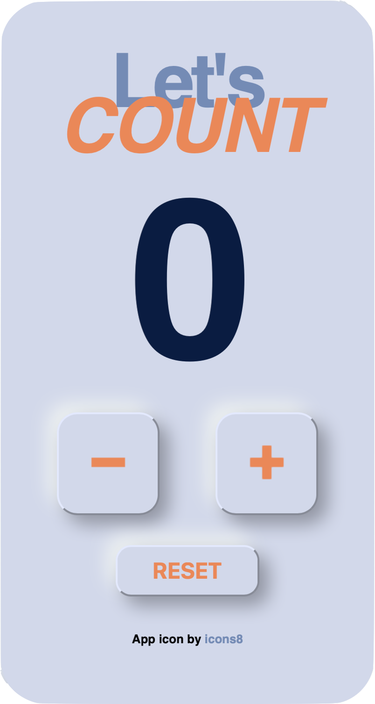

# Let's count
_Let's count_ is an application counter, suitable also for mobile. 

## :mag: Usage 
Check out the <a href="https://www.google.com" target="_blank">demo </a> on Netlify.

## :hammer: Tech
- JAVASCRIPT
- HTML
- CSS
## :telephone_receiver: Contact
Drop a line [here](https://kassandra-94.github.io/docs/contact.html).

